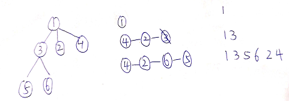

[N叉树的前序遍历](https://leetcode-cn.com/problems/n-ary-tree-preorder-traversal/)

* 迭代 前序遍历 根左右（linkedlist）

1. 迭代
2. 

```
LinkedList<Node> mystack=new LinkedList<Node>();
       ArrayList<Integer> result=new ArrayList<>();
        if(root==null){
            return result;
        }
       mystack.add(root);
       while (!mystack.isEmpty()){
          Node node=mystack.pollLast();
          result.add(node.val);
          Collections.reverse(node.children);
          for(Node i:node.children){
              mystack.addLast(i);
          }
       }
       return result;
```

* 递归

1. 先根，再一次遍历孩子

```
 List<Integer> result=new ArrayList<>();
    public List<Integer> preorder(Node root) {
      
        if(root==null){
            return result;
        }
        result.add(root.val);
        for(Node node:root.children){
            result = preorder(node);
        }
       return result;
```
