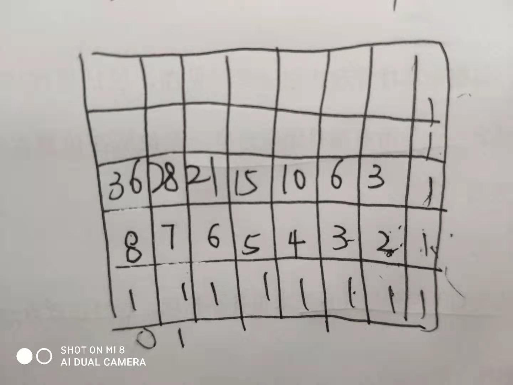

#### [不同路径](https://leetcode-cn.com/problems/unique-paths/)
{: id="20201209160135-duqdih8"}

递推公式：dp[m][n]=dp[m-1][n]+dp[m][n-1]
{: id="20201209160151-dm818ja"}

当前节点的值=下面一个格子的值+右面格子的值
{: id="20201209160721-f54xclt"}


{: id="20201209160755-k3ourgs"}

{: id="20201209160151-fmsqh4m"}

```
 public int uniquePaths(int m, int n) {
         int [][] a=new int[m][n];
        for(int i=0;i<n;i++){
            a[0][i]=1;
        }
        for(int i=0;i<m;i++){
            a[i][0]=1;
        }
        for(int i=1;i<m;i++){
            for(int j=1;j<n;j++){
                a[i][j]=a[i-1][j]+a[i][j-1];
            }
        }
        return a[m-1][n-1];
    }
```
{: id="20201209160137-2zgalrn"}

{: id="20201209161014-t8498ty"}
