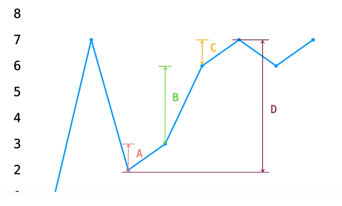

#### [买卖股票的最佳时机 II](https://leetcode-cn.com/problems/best-time-to-buy-and-sell-stock-ii/)
{: id="20201222141636-kc5h8al"}

* {: id="20201222141713-1xdspbm"}暴力法（贪心）


{: id="20201222141732-a0wf9zx"}

如图，D的利润等于A+B+C的利润
{: id="20201222141802-0z9x3k2"}

```
 int profit=0;
       for(int i=0;i<prices.length-1;i++){
               profit+=Math.max(0,prices[i+1]-prices[i]);
       }
       return profit;
```
{: id="20201222141822-0e30is3"}

* {: id="20201222142342-m1py51l"}动态规划
{: id="20201222142342-mnx8fwx"}

0为不持有股票，1为持有股票
{: id="20201222142344-8hhljel"}

dp[i][0]=max{dp[i-1][0],dp[i-1][1]+a[i]}
{: id="20201222142403-vzudt4h"}

dp[i][1]=max{dp[i-1][0]-a[i],dp[i-1][1]}
{: id="20201222142451-4pwnedr"}
