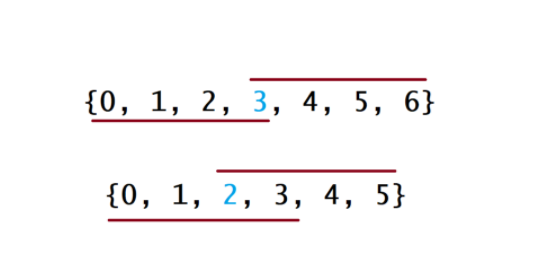

#### [多数元素](https://leetcode-cn.com/problems/majority-element/)
{: id="20201112140743-4k59hel"}

* {: id="20201112140752-ayb2l9o"}HashMap
{: id="20201112140752-ghwiz8o"}

时间复杂度：遍历数组的每个元素为O(n)，hash表操作为常数级的操作
{: id="20201112140835-s8dj7lg"}

空间复杂度：哈希表最多包含 n-n/2 个键值对，所以占用的空间为 O(n)
{: id="20201112140919-51eo6k7"}

```
 HashMap<Integer,Integer> map=new HashMap<>();
        for(int num:nums){
            int value=map.getOrDefault(num,0);
            value++;
            if(value>nums.length/2){
                return num;
            }
            map.put(num,value);
        }
        return 0;
```
{: id="20201112140756-8gqt7ym"}

* {: id="20201112141145-78ymnrs"}排序
{: id="20201112141145-rzt7mvi"}


{: id="20201112141147-ijgqeka"}

1. {: id="20201112141307-9vy4uta"}将数组排序后，多数元素占>n/2，所以在n/2的位置会找到这个数
{: id="20201112141307-j03oegu"}

时间复杂度：语言自带数组排序Ologn
{: id="20201112141402-hojnm1l"}

空间复杂度：系统排序用logn的栈
{: id="20201112141604-gnnoxwu"}

```
Arrays.sort(nums);
       return nums[nums.length/2];
```
{: id="20201112141621-m2xgzip"}

*
