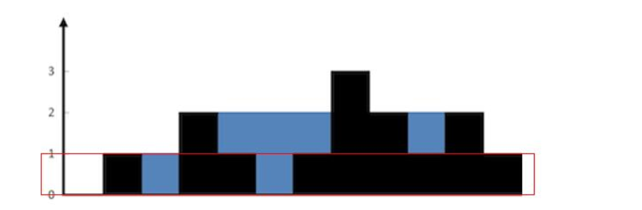

[接雨水](https://leetcode-cn.com/problems/trapping-rain-water/)
{: id="20201105143116-uoyy00e"}

* {: id="20201105143138-6r4gf7n"}非常好理解的方法（分层）
{: id="20201105143206-ng3az5q"}

1. {: id="20201105144243-mg1qirv"}
{: id="20201105144243-xvyhow6"}

{: id="20201105144055-6p2vqby"}
