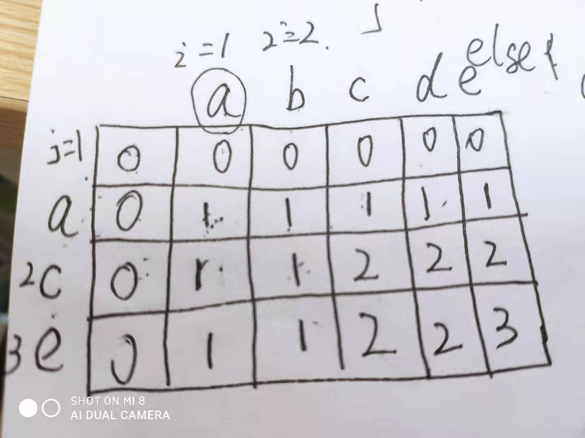

#### [最长公共子序列](https://leetcode-cn.com/problems/longest-common-subsequence/)
{: id="20201211120626-mzza7sr"}

动态规划
{: id="20201211120627-mbgmnvb"}

{: id="20201211121001-uaih4zl"}

{: id="20201211121001-teuuh0k"}

dp
{: id="20201211121002-jy6nden"}

{: id="20201211120639-c6ohldc"}
