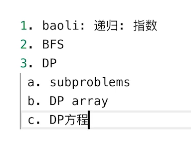

{: id="20201216134645-u3zu1rf"}

解法：
{: id="20201216134647-87orrir"}

{: id="20201216134739-cf5jdsu"}

dp方程。由上楼梯的dp方程dp[n]=dp[n-1]+dp[n-2];（可以上一步或者两步）
{: id="20201216134820-31kxz3j"}

=》dp[n]=min(dp[n-k] k in coins)+1
{: id="20201216135100-lku08n2"}
