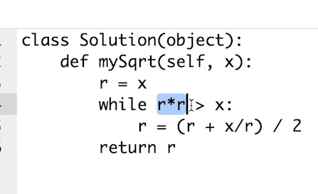

二分查找前提
{: id="20201124110158-rab29xj"}

1. {: id="20201124110207-jt1g7ip"}单调递增或者递减
2. {: id="20201124110212-wgk9zx0"}存在上下界
3. {: id="20201124110217-pud6ko4"}能够通过索引访问
{: id="20201124110207-h5wb7vk"}

{: id="20201124123953-1n3k10b"}

牛顿
{: id="20201124123952-tjbpqjr"}


{: id="20201124124038-713lybm"}

JAVA
{: id="20201124124050-b979n8e"}

```
// Java
public int binarySearch(int[] array, int target) {
    int left = 0, right = array.length - 1, mid;
    while (left <= right) {
        mid = (right - left) / 2 + left;

        if (array[mid] == target) {
            return mid;
        } else if (array[mid] > target) {
            right = mid - 1;
        } else {
            left = mid + 1;
        }
    }

    return -1;
}
```
{: id="20201124125349-4ub97hn"}

C++
{: id="20201124125408-fnzx2js"}

```
C/C++

int binarySearch(const vector<int>& nums, int target) {
	int left = 0, right = (int)nums.size()-1;

	while (left <= right) {
		int mid = left + (right - left)/ 2;
		if (nums[mid] == target) return mid;
		else if (nums[mid] < target) left = mid + 1;
		else right = mid - 1;
	}

	return -1;
}
```
{: id="20201124125409-yvg7idu"}
