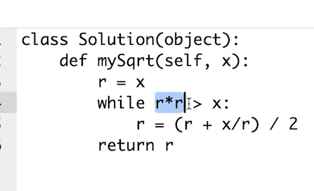

二分查找前提
{: id="20201124110158-rab29xj"}

1. {: id="20201124110207-jt1g7ip"}单调递增或者递减
2. {: id="20201124110212-wgk9zx0"}存在上下界
3. {: id="20201124110217-pud6ko4"}能够通过索引访问
{: id="20201124110207-h5wb7vk"}

{: id="20201124123953-1n3k10b"}

{: id="20201124123952-tjbpqjr"}
