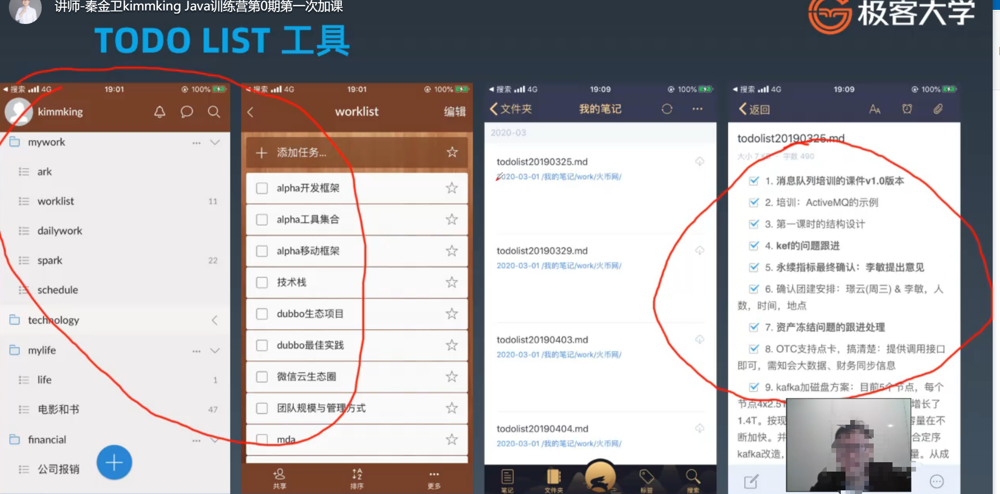
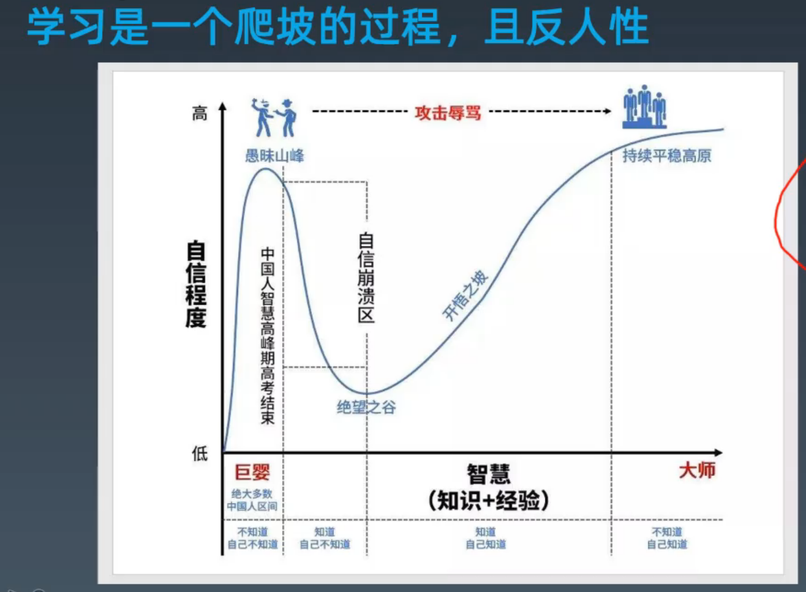

怎么管理时间：
{: id="20201106102512-rdaibsf"}

* {: id="20201106102604-os0tt7a"}TODO LIST
{: id="20201106102604-putpsxw"}

1. {: id="20201106103536-yx5n3dq"}不仅记事情，还记状态（完成一半，还是全部完成）
2. {: id="20201106103036-yuo6trc"}优先级是多少
3. {: id="20201106103536-axq4ses"}事情不要太大，不要两个星期才做完
4. {: id="20201106103939-kqk9l0i"}凡事21天就会养成习惯
5. {: id="20201106104024-vro597t"}时间不够用，就需要时间管理
6. {: id="20201106104512-hn02gyo"}例子：
{: id="20201106103035-ti3r5p7"}

怎么学习：
{: id="20201106105521-j5ddghe"}

学习，和别人谈话要有一个开放的心态。在不了解的时候，不要先去贬低他
{: id="20201106105526-zy1mfd9"}

基础是技术人员核心的竞争力
{: id="20201106110202-ocqud9g"}

{: id="20201106110125-swjf60c"}

记不住：
{: id="20201106110154-gzw04ki"}

1. {: id="20201106110426-158fboi"}写的不够
2.
{: id="20201106110427-oms9cf7"}
{: id="20201106110423-bcgy3ba"}
