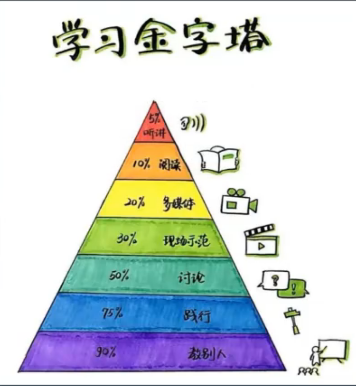

怎么管理时间：

* TODO LIST

1. 不仅记事情，还记状态（完成一半，还是全部完成）
2. 优先级是多少
3. 事情不要太大，不要两个星期才做完
4. 凡事21天就会养成习惯
5. 时间不够用，就需要时间管理
6. 例子：

怎么学习：

学习，和别人谈话要有一个开放的心态。在不了解的时候，不要先去贬低他

基础是技术人员核心的竞争力

记不住：

1. 写的不够
2. 有规律

