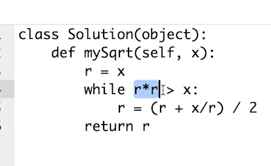

二分查找前提

1. 单调递增或者递减
2. 存在上下界
3. 能够通过索引访问

牛顿



JAVA

```
// Java
public int binarySearch(int[] array, int target) {
    int left = 0, right = array.length - 1, mid;
    while (left <= right) {
        mid = (right - left) / 2 + left;

        if (array[mid] == target) {
            return mid;
        } else if (array[mid] > target) {
            right = mid - 1;
        } else {
            left = mid + 1;
        }
    }

    return -1;
}
```

C++

```
C/C++

int binarySearch(const vector<int>& nums, int target) {
	int left = 0, right = (int)nums.size()-1;

	while (left <= right) {
		int mid = left + (right - left)/ 2;
		if (nums[mid] == target) return mid;
		else if (nums[mid] < target) left = mid + 1;
		else right = mid - 1;
	}

	return -1;
}
```

Python

```
# Python
left, right = 0, len(array) - 1 
while left <= right: 
	  mid = (left + right) / 2 
	  if array[mid] == target: 
		    # find the target!! 
		    break or return result 
	  elif array[mid] < target: 
		    left = mid + 1 
	  else: 
		    right = mid - 1
```

JS

```
/* JavaScript */
let left = 0, right = len(array) - 1
while (left <= right) {
  let mid = (left + right) >> 1
  if (array[mid] === target) { /*find the target*/; return }
  else if (array[mid] < target) left = mid + 1
  else right = mid - 1
}
```
