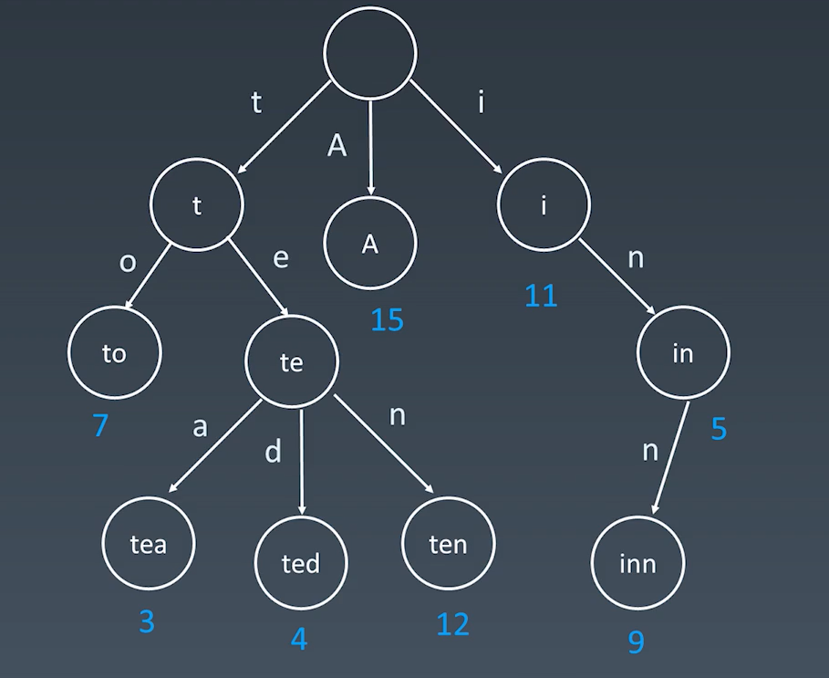

基本性质
{: id="20210107212441-9trjkco"}

* {: id="20210107212441-9ip1viv"}结点本身不存在完整的单词
* {: id="20210107212441-6edco7c"}从根结点到某一结点，路径上经过的字符连接起来，为该结点对应的字符串
* {: id="20210107212441-msjtxot"}每个结点的所有子结点路径代表的字符都不相同
{: id="20210107212441-xfv4b2s"}

优点：最大
{: id="20210107212451-9tanwp8"}

结点还可以存储额外的信息，例如访问的频次，根据频次可以给用户做推荐
{: id="20210107212441-0gettfw"}

{: id="20210107212441-s3waf6i"}
