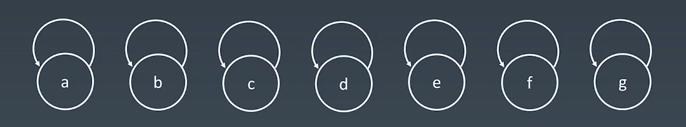
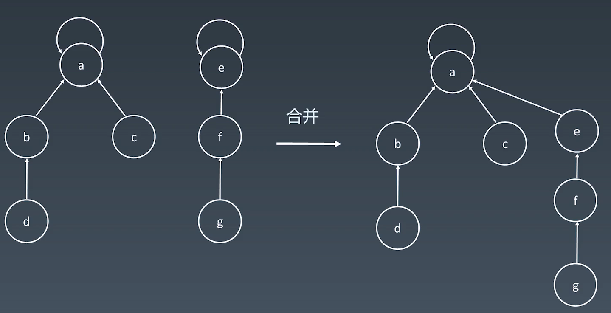

{: id="20210111151220-6ui942c"}

初始化
{: id="20210111173832-dg3o5py"}


{: id="20210111173632-td0891b"}

合并
{: id="20210111173840-pdvdb3o"}


{: id="20210111173848-xr9ou6m"}

路径压缩
{: id="20210111194538-7yo1kdl"}

```java

```
{: id="20210111200819-62kqvrz"}
