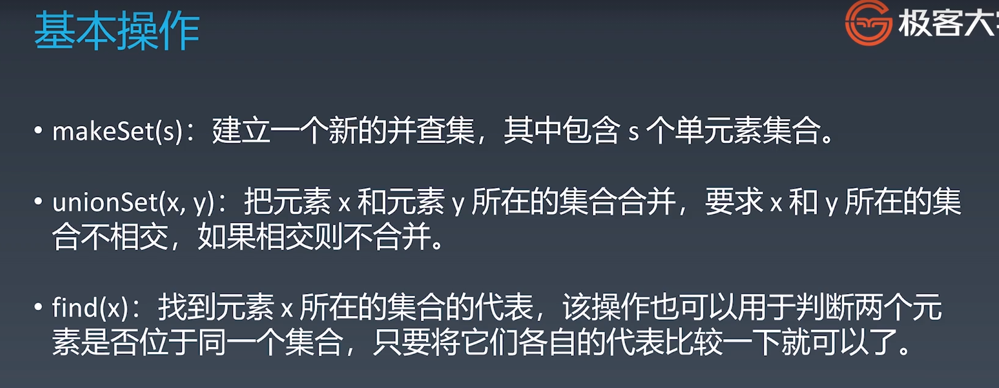

{: id="20210111151220-kp9e2xc"}

{: id="20210111151220-6ui942c"}

初始化
{: id="20210111173832-dg3o5py"}

{: id="20210111173632-td0891b"}

合并
{: id="20210111173840-pdvdb3o"}

{: id="20210111173848-xr9ou6m"}

路径
{: id="20210111194538-7yo1kdl"}
